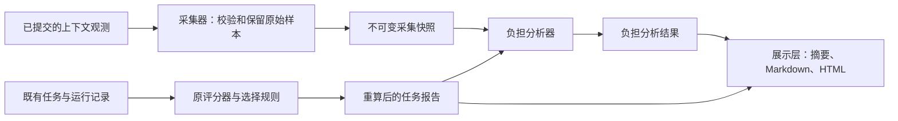

# 负担视图的采集、分析与展示分层

用户授权：2026-10-01，“按照你建议的架构把采集器、分析器和展示层分开”。本次是既有负担视图的内部重构，版本保持 0.8.0。



## 各层职责

| 层 | 文件 | 接收与产出 | 不承担的职责 |
| --- | --- | --- | --- |
| 内部契约 | `value_lab/burden_contracts.py` | `ContextRun` 和 `BurdenCollection`，不可变字段与元组 | 不定义新的外部 JSON 协议或真实性认证 |
| 采集器 | `value_lab/burden_collector.py` | 接收既有 `pvl-context-observations-1` 材料，校验设计、会话、记录摘要、口径与请求序号，生成独立快照 | 不计算峰值、可行性、候选排名；不联网或读宿主状态 |
| 分析器 | `value_lab/burden_analyzer.py` | 接收采集快照和重算后的任务报告，计算完整性、上下文峰值、逐任务差值和三维支配关系 | 不重新采集，不写文件，不组织页面，不改变候选选择 |
| 展示层 | `value_lab/burden_presentation.py`、`value_lab/decision_view.py` | 读取分析报告，生成文字、证据摘要与按需展开页面 | 不读取原始采集材料，不调用分析器，不触发执行 |
| 兼容与编排 | `value_lab/burden_view.py`、既有组合与工作流模块 | 旧 `build` / `markdown` 入口继续可用；流程层组合各层并保存产物 | 不复制测量或比较逻辑 |

采集器当前是**已提交材料的适配器**。原始费用和耗时仍经既有运行记录、完整费用声明及原评分器进入任务报告，分析器只使用该报告中经过既有门槛的值。此次没有接入 Claude、Codex 或其他宿主的实时采集接口，也没有把图中的状态栏当作可调用协议。

## 边界与依赖

输入侧先由既有组合校验器核对设计与运行记录，再由采集器校验上下文附加材料。不可变快照保留原始请求序号、token 数、覆盖声明、会话及记录摘要；不会把采样峰值提前写成原始观测。调用方之后修改原始字典，不会更改快照。

分析器只接受内部采集契约与重算报告，核对设计和观测摘要一致，拒绝混用其他研究或运行的报告。这里的摘要是关联检查，不是签名、宿主真实性或防恶意进程认证。内部数据对象不作为接受不可信 JSON 的新入口。

分析器输出保持 `pvl-burden-view-1`。费用、耗时与逐任务可行性继续来自原报告。部分采样、缺失上下文、失败候选及未知状态保持原有含义；所有差值、分母、权重和算术容差不变。

原组合评分提取为内部 `_analyze_tasks`，只重算任务证据；既有 `analyze` 兼容入口仍返回默认负担视图。请求编排现在每次只采集并分析一次，消除先计算缺失上下文视图、再用附加材料重算的重复流程。

展示层可以从已经保存的报告 JSON 重放，不需要原采集器或分析器可用。已移除 `decision_view → workflow` 的反向依赖；Markdown 转义属于展示层。页面继续先显示当前问题，再按需展开证据。

## 验证与复现

`tests/test_burden_layers.py` 验证原始样本保留、不可变快照、调用方修改隔离、摘要混用拒绝、独立分析重放、展示时不采集/不分析，以及层间依赖方向。

拆分前保存了“全面更低、存在取舍、持平、数据缺失”四个制造场景的原始输出，再将各输出摘要存入 `tests/fixtures/burden-layering-before.json`。测试逐项比较完整分析报告、证据摘要、HTML 和两种 Markdown，防止仅检查候选名称而漏掉证据或展示变化。该快照为合成逻辑验收，不代表真实宿主收益。

```text
python -m unittest tests.test_burden_layers tests.test_burden_view tests.test_decision_view tests.test_plugin_combinations tests.test_workflow -q
python scripts/check_release_tests.py
python scripts/check_feature_freeze.py
python scripts/build_marketplace.py --check
python scripts/validate_agent_plugin.py
```

本次验收另存为 `docs/evidence/burden-layers-20261001.json`。此前负担视图和交互报告的验收摘要保留历史身份，不改写成对重构后源码的认证。安装中的插件副本与发布状态不因本地重构自动变化。
